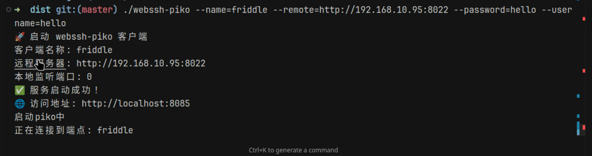

# webssh-piko

[中文文档](README_CN.md) | English

An efficient terminal-based remote assistance tool that integrates webssh and piko services. Designed for remote assistance in complex network environments, avoiding the high bandwidth dependency of traditional remote desktop solutions while eliminating the need for complex network configurations and public IP addresses.

webssh: https://github.com/Jrohy/webssh
piko: https://github.com/andydunstall/piko

## Features

- 🚀 **Lightweight**: Terminal-based remote assistance with low resource usage
- 🌐 **Network-friendly**: Supports intranet penetration, no public IP required
- 🔧 **Easy Deployment**: One-click Docker deployment with simple configuration
- 🔒 **Secure & Reliable**: Based on SSH protocol with user authentication support
- 📱 **Cross-platform**: Supports Linux, macOS, Windows

## Architecture

```
Client (webssh-piko client)
    ↓ Local Shell
webssh service
    ↓ HTTP access
Browser terminal
```

## Quick Start

### Server Deployment

1. **Deploy using Docker Compose**

```yaml
# docker-compose.yaml
version: "3.8"
services:
  piko:
    image: ghcr.io/friddle/webssh-piko-server:latest
    container_name: webssh-piko-server
    environment:
      - PIKO_UPSTREAM_PORT=8022
      - LISTEN_PORT=8088
    ports:
      - "8022:8022"
      - "8088:8088"
    restart: unless-stopped
```

Or using Docker directly:

```bash
docker run -ti --network=host --rm --name=piko-server ghcr.io/friddle/webssh-piko-server
```

2. **Start the service**

```bash
docker-compose up -d
```

### Client Usage

#### Linux Client

```bash
# Download client
wget https://github.com/friddle/webssh-piko/releases/download/v1.0.1/webssh-piko-linux-amd64 -O ./websshp
chmod +x ./websshp

./websshp --name=local --remote=192.168.1.100:8088
```

#### Windows Client

```powershell
# Download client (PowerShell)
Invoke-WebRequest -Uri "https://github.com/friddle/webssh-piko/releases/download/v1.0.1/webssh-piko-windows-amd64.exe" -OutFile "websshp.exe"

# Access with authentication
Start-Process -FilePath websshp.exe -ArgumentList "--name=admin --remote=http://192.168.1.100:8088" -NoNewWindow -Wait
```


#### macOS Client

```bash
# Download client
curl -L -o websshp https://github.com/friddle/webssh-piko/releases/download/v1.0.1/webssh-piko-darwin-amd64
chmod +x ./websshp

./websshp --name=local --remote=192.168.1.100:8088
```




## Access Methods

After starting the client, access the corresponding terminal via:
```
http://host-server-ip:port/client-name
```

Example:
- Server listening address: `192.168.1.100:8088` (server IP and NGINX)
- Client name: `local`
- Access URL: `http://192.168.1.100:8088/local`

## Configuration

### Client Parameters

| Parameter | Short | Description | Default | Required |
|-----------|-------|-------------|---------|----------|
| `--name` | `-n` | piko client identifier name | - | ✅ |
| `--remote` | `-r` | Remote piko server address (format: host:port) | - | ✅ |
| `--username` | `-u` | Username | - | ❌ |
| `--password` | `-p` | Password | - | ❌ |
| `--timeout` | - | Timeout in seconds | 30 | ❌ |
| `--debug` | - | Enable debug mode | false | ❌ |

### Server Environment Variables

| Variable | Description | Default |
|----------|-------------|---------|
| `PIKO_UPSTREAM_PORT` | Piko upstream port | 8022 |
| `LISTEN_PORT` | HTTP listen port | 8088 |
